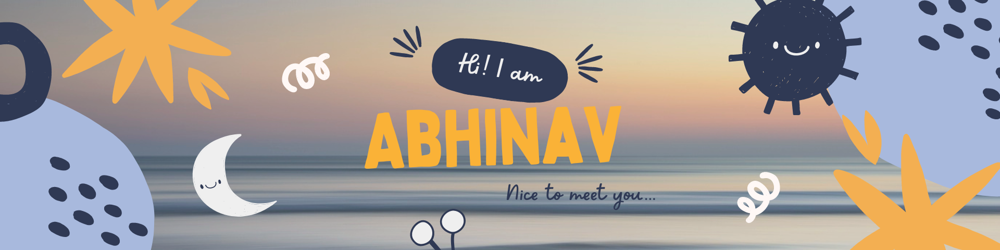

<h2> About me </h2>

<ul>
  <li><b>👤 Name: </b> Abhinav Sonone</li>
  <li><b>😄 Pronouns:</b>  He/Him</li>
  <li><b>📍 Location:</b> India</li>
  <li><b>💼 Job: </b>Open to Work</li>
  <li><b>📣 Languages:</b> English, Marathi and Hindi</li>
</ul>

<h2> Lets Talk Stats ...</h2>

<h2> I'm currently ...</h2>

<li><b>📖 learning: </b> AI/ML</li>
  <li><b>📖 Reading:</b>  One Hundred Years of Solitude by Gabriel García Márquez</li>
  <li><b>🎵listening:</b> Imagine- John Lenon</li>
